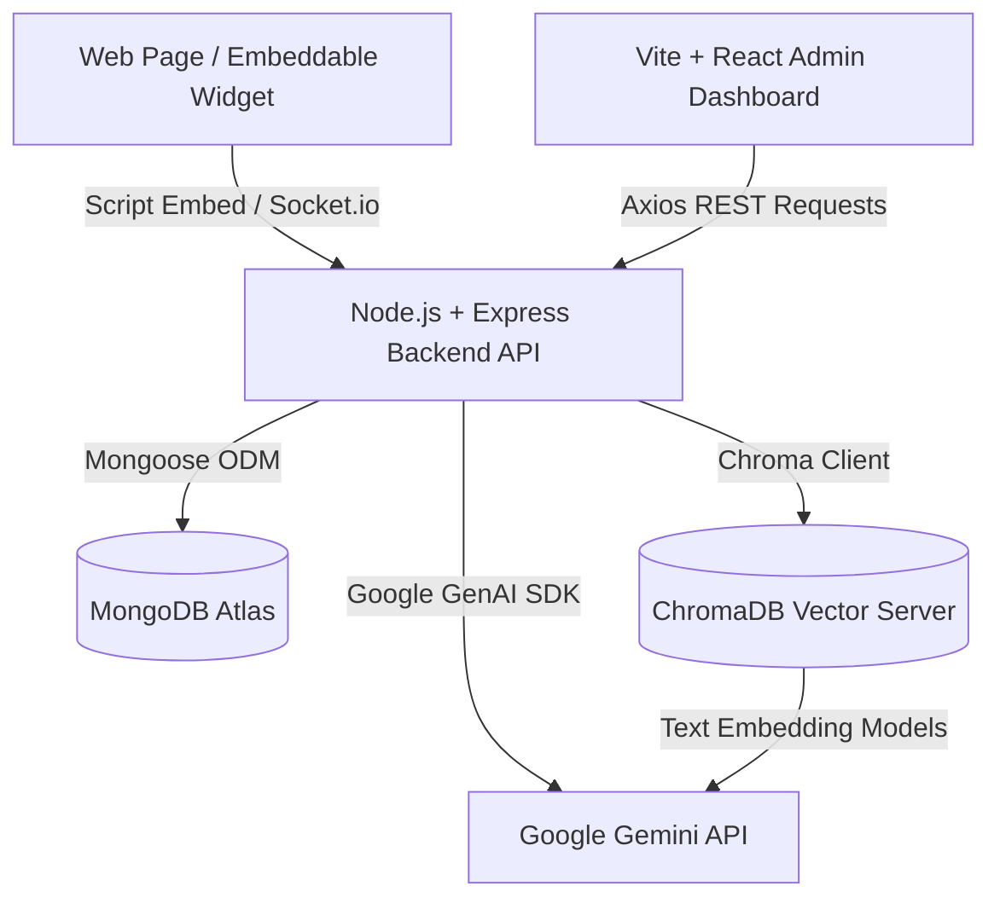

# SupportAI — AI Customer Support Assistant Platform

A full-stack, multi-tenant SaaS platform for AI-powered customer support assistants trained on your knowledge base.

## 🚀 Quick Start

### Prerequisites
- Node.js 18+
- Python 3.9+
- MongoDB Atlas account (or local MongoDB)
- Google Gemini API key

---

## ⚙️ Setup

### 1. Clone & Configure Backend

```bash
cd backend
npm install
cp .env.example .env
```

Edit `.env` and fill in:
```env
MONGODB_URI=mongodb+srv://...    # Your MongoDB Atlas URI
GEMINI_API_KEY=your_key_here     # Your Google Gemini API key
```

### 2. Install Frontend

```bash
cd frontend
npm install
```

### 3. Install ChromaDB (Python)

```bash
pip install chromadb
```

---

## 🏃 Running the Platform

You need **3 terminals** running simultaneously:

### Terminal 1 — ChromaDB Server
```bash
# From project root
python start_chroma.py
# OR directly:
chroma run --path ./chroma_data --host localhost --port 8000
```

### Terminal 2 — Backend API
```bash
cd backend
npm run dev
# Runs on http://localhost:5000
```

### Terminal 3 — Frontend
```bash
cd frontend
npm run dev
# Runs on http://localhost:5173
```

### Open the App
Navigate to **http://localhost:5173** and register your first business account.

---

## 🗺️ Feature Map

| Feature | Location |
|---------|----------|
| Register / Login | `/register`, `/login` |
| Dashboard | `/dashboard` |
| Upload Documents | `/knowledge-base` |
| Configure AI Bot | `/ai-config` |
| View Tickets | `/tickets` |
| Escalation Dashboard | `/escalations` |
| Conversation History | `/conversations` |
| Analytics | `/analytics` |

---

## 🔌 Embeddable Widget

Add the chat widget to any website:

```html
<script
  src="http://localhost:5000/widget/widget.js"
  data-tenant-id="YOUR_TENANT_ID"
></script>
```

Find your `tenantId` on the Dashboard page.

---

## 🏗️ Architecture

```
Frontend (React + TypeScript + Vite)
    ↓ REST API + WebSocket
Backend (Express + Node.js)
    ↓                    ↓
MongoDB Atlas       ChromaDB (Vector DB)
                        ↓
                   Google Gemini API
                   (Chat + Embeddings)
```

---

## 📁 Project Structure

```
├── backend/           # Express API server
│   ├── src/
│   │   ├── config/    # DB, Gemini config
│   │   ├── middleware/ # Auth, RBAC, upload
│   │   ├── models/    # MongoDB schemas
│   │   ├── routes/    # API endpoints
│   │   └── services/  # AI, vector, document services
│   └── .env.example
│
├── frontend/          # React admin portal
│   └── src/
│       ├── components/
│       ├── pages/
│       ├── contexts/
│       └── services/
│
├── widget/            # Embeddable chat widget
│   └── widget.js
│
├── requirements.txt   # Python ChromaDB dependency
├── start_chroma.py    # ChromaDB startup script
└── README.md
```

---

## 🔑 API Endpoints

| Method | Endpoint | Description |
|--------|----------|-------------|
| POST | `/api/auth/register` | Register business |
| POST | `/api/auth/login` | Login |
| GET | `/api/dashboard/stats` | Dashboard metrics |
| POST | `/api/documents/upload` | Upload document |
| DELETE | `/api/documents/:id` | Delete document |
| POST | `/api/documents/reindex` | Re-index KB |
| GET/PUT | `/api/ai-config` | Bot configuration |
| POST | `/api/chat/message` | Send chat message |
| GET | `/api/conversations` | List conversations |
| GET/PUT | `/api/tickets` | Ticket management |
| GET | `/api/escalations` | Escalation dashboard |
| GET | `/api/analytics` | Analytics data |

---

## 🌟 Bonus Features Implemented

- ✅ **Multi-Tenant SaaS** — Each business has isolated data, documents, and chatbot
- ✅ **Embeddable Widget** — Drop-in `<script>` tag for any website
- ✅ **Human Handoff** — Socket.io based agent join via admin
- ✅ **Real-time Escalation** — Live notifications via WebSocket
- ✅ **Conversation History** — Full searchable message logs

---

## 🔒 Environment Variables

| Variable | Description |
|----------|-------------|
| `MONGODB_URI` | MongoDB Atlas connection string |
| `GEMINI_API_KEY` | Google Gemini API key |
| `JWT_SECRET` | JWT signing secret |
| `JWT_REFRESH_SECRET` | JWT refresh token secret |
| `CHROMA_HOST` | ChromaDB host (default: localhost) |
| `CHROMA_PORT` | ChromaDB port (default: 8000) |
| `FRONTEND_URL` | Frontend URL for CORS |

---

## 🚀 Live Demo & Submission Details

* **Live Frontend URL:** [https://ai-support-platform-1-sxpx.onrender.com](https://ai-support-platform-1-sxpx.onrender.com)
* **Live Backend API:** [https://ai-support-platform-wnxd.onrender.com](https://ai-support-platform-wnxd.onrender.com)
* **Live Vector Database:** [https://ai-support-chroma.onrender.com](https://ai-support-chroma.onrender.com)
* **GitHub Repository:** [https://github.com/Rohandabas/AI-Support-platform](https://github.com/Rohandabas/AI-Support-platform)
* **Sample Knowledge Base Data:** `sample_knowledge_base.txt` (Available at the root of the repository)
* **Demo Admin Credentials:**
  * **Email:** `vinod@gmail.com`
  * **Password:** `123456`
  * **Tenant ID:** `7c97ccb8-3687-47b3-836f-f65cc94fbeaa`

### 🏗️ Application Architecture Diagram



